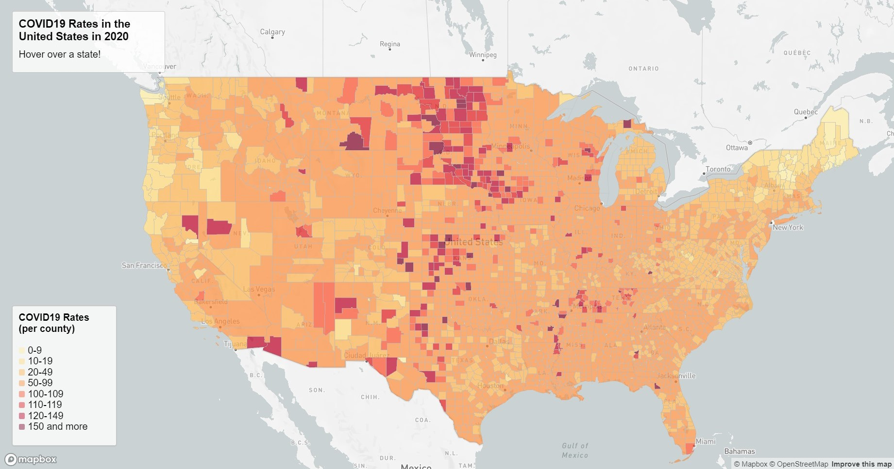
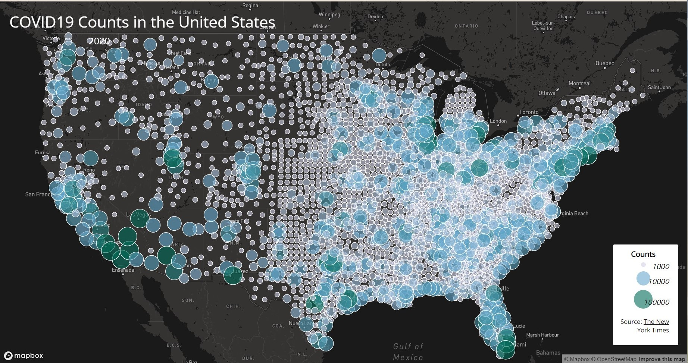

# COVID19-rates-and-cases visualizations

## Introduction 
The following two maps are primarily focused on visualizing COVID19 rates and counts in the United States during the year of 2020. 

In the [first map](https://github.com/elilsan/COVID19-rates-and-cases/blob/54edcee3c826642ec410fe427dda0cc58999365f/map1.html), we can see that COVID19 rates are being visualized based on counties, and not necessarily states. In additon, this is a choropleth map, which means that color is categorized by specific data ranges. Categorizing the data rate by county makes it easier to see exactly which areas are reported to have higher rates of COVID19 infections. In addition, it would be confusing to the viewer if the data were to be categorized by state. In additon, this map also utilizes a hover function, which tells the user the exact rate of that specific county. 

In the [second map](https://github.com/elilsan/COVID19-rates-and-cases/blob/0f4d77634b6281244e2deff5ecd351c9e3dcb1b6/map2.html), the COVID19 counts were visualized with proportional symbols. This made the counts easier to see for the viewer because in this way, we can see were more people were infected and where there could be clusters, indicating that a certain area could be having more infected people than other areas. This map also uses the click function to give the user a specific count of COVID infection in a specific dot, making the data even more clear and less abstract. 

## Sources
Both maps had data from The New York Times, in addition to the US Census Bureau. Credit to code structure goes to Professor Bo Zhao. 